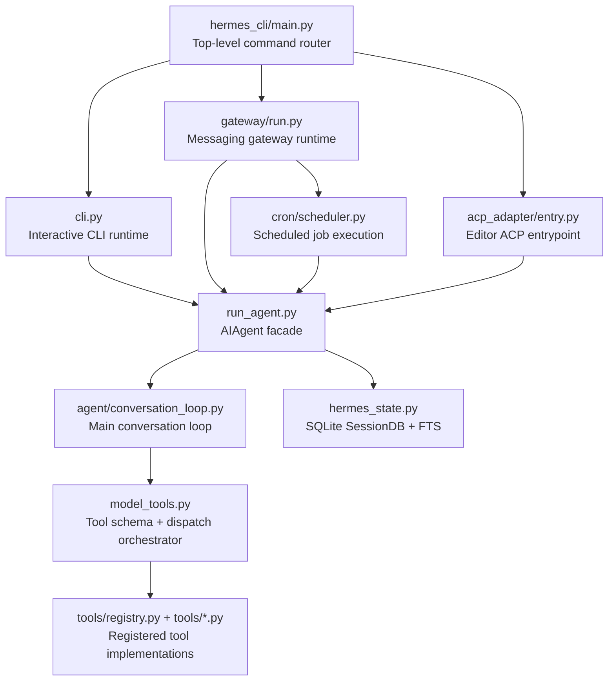

# LEARNING_GUIDE.md

## Section 1: What Is This? (The One-Paragraph Summary)
Hermes Agent is a Python-based AI assistant framework that can run in multiple modes: terminal chat, messaging platforms (Telegram/Discord/Slack and others), scheduled automation, and editor integrations. It is built like a platform, not a single script: one core agent engine handles model calls and tool execution, while surrounding modules provide CLI UX, gateway routing, state storage, plugin loading, and optional features like cron and MCP bridges. Think of it as a "brain + body" system: the brain is the agent loop, and the body is all the interfaces that feed requests to that loop and deliver results back to users. By the time you finish this guide, you will understand how Hermes starts, routes requests, executes tools safely, stores history, and can be extended.

## Section 2: What Problem Does This Solve?
Hermes exists to solve a practical problem: people want one AI assistant that works across environments and keeps context over time, instead of rebuilding workflows in many disconnected tools.

Who it is for:
- Developers who want a tool-calling coding assistant in terminal and editor workflows
- Operators who need messaging bots and scheduled automations
- Power users who want plugin-based extensions and persistent session history

Before and after scenario:
- Before: You run separate scripts for CLI chat, another bot for Telegram, another scheduler, and no shared memory/history. You reconfigure models and tools in each place.
- After: Hermes provides a single core agent with shared tool architecture, shared state database, shared command model, and multiple front doors (CLI, gateway, ACP, MCP).

Why this matters: a unified architecture lowers operational complexity and makes behavior more predictable across interfaces.

## Section 3: The Big Picture — How It All Fits Together

Plain-English walkthrough:
1. A user starts in one entry path: CLI command, gateway bot message, or editor ACP session.
2. That interface layer prepares configuration and creates/uses an AIAgent instance.
3. AIAgent forwards actual turn execution to the conversation loop in `agent/conversation_loop.py`.
4. During a turn, model_tools decides which tool schemas are visible and dispatches tool calls.
5. Tool handlers come from the central registry that auto-discovers tool modules.
6. Session data and searchable history go to SQLite via SessionDB.
7. The cron scheduler can trigger the same agent loop on a schedule, feeding work back into the same architecture.

Why this matters: once you understand this path, most of the repo becomes easier to reason about because many modules are adapters around this same center.

## Section 4: File & Folder Map
This repository has 4,500+ files, so this map is intentionally focused on the core 20-25 files that control runtime behavior. Selection criteria: entry points, orchestration layers, persistence, tool registry, and extension mechanisms.

### 🚀 Entry Points
- Full path: `hermes_cli/main.py`
  - Role: Main command router for `hermes` CLI commands.
  - Why it matters: If removed, the primary CLI command surface breaks.
- Full path: `cli.py`
  - Role: Interactive CLI implementation and command processing loop.
  - Why it matters: If removed, terminal chat UX and slash-command handling disappear.
- Full path: `run_agent.py`
  - Role: Defines `AIAgent` and top-level agent API.
  - Why it matters: If removed, every interface loses core model+tool execution.
- Full path: `gateway/run.py`
  - Role: Multi-platform messaging gateway runtime.
  - Why it matters: If removed, Telegram/Discord/Slack-style integrations break.
- Full path: `acp_adapter/entry.py`
  - Role: ACP adapter entrypoint for editor integration.
  - Why it matters: If removed, ACP-based editor workflows fail.
- Full path: `mcp_serve.py`
  - Role: MCP server exposing Hermes conversations/tools to MCP clients.
  - Why it matters: If removed, MCP bridge workflows are unavailable.
- Full path: `batch_runner.py`
  - Role: Batch dataset execution using AIAgent workers.
  - Why it matters: If removed, trajectory/data generation pipelines are reduced.

### ⚙️ Configuration
- Full path: `pyproject.toml`
  - Role: Packaging metadata, dependencies, and script entry points.
  - Why it matters: If removed, installation and script resolution fail.
- Full path: `toolsets.py`
  - Role: Toolset definitions and composition rules.
  - Why it matters: If removed, tool visibility policy collapses.
- Full path: `cli-config.yaml.example`
  - Role: Example user configuration shape.
  - Why it matters: If removed, onboarding and config discoverability degrade.
- Full path: `.env.example`
  - Role: Environment variable template.
  - Why it matters: If removed, secrets setup is harder and error-prone.

### 🧠 Core Logic
- Full path: `agent/conversation_loop.py`
  - Role: Real conversation execution loop used by AIAgent.
  - Why it matters: If removed, requests cannot complete end-to-end.
- Full path: `model_tools.py`
  - Role: Collects tool definitions and dispatches tool calls.
  - Why it matters: If removed, model tool-calling becomes non-functional.
- Full path: `tools/registry.py`
  - Role: Global registration/discovery/dispatch backend for tools.
  - Why it matters: If removed, tool ecosystem cannot be composed.
- Full path: `hermes_state.py`
  - Role: SessionDB SQLite storage with FTS search.
  - Why it matters: If removed, session history and search break.
- Full path: `agent/memory_manager.py`
  - Role: Memory provider orchestration and context fencing.
  - Why it matters: If removed, memory integration and safety boundaries degrade.
- Full path: `cron/scheduler.py`
  - Role: Tick runner for scheduled job execution.
  - Why it matters: If removed, cron automations do not execute.

### 🧩 Utilities
- Full path: `hermes_constants.py`
  - Role: Canonical path/home resolution (profile-aware).
  - Why it matters: If removed, many modules misresolve config/state paths.
- Full path: `hermes_logging.py`
  - Role: Logging setup for agent/gateway logs.
  - Why it matters: If removed, diagnostics and operational observability suffer.
- Full path: `utils.py`
  - Role: Shared helper functions used broadly.
  - Why it matters: If removed, many modules lose common primitives.

### 📦 Models / Data Structures
- Full path: `hermes_cli/commands.py`
  - Role: Central slash command registry via `CommandDef` dataclass.
  - Why it matters: If removed, command metadata and routing consistency fail.
- Full path: `gateway/config.py`
  - Role: Gateway configuration model/loader helpers.
  - Why it matters: If removed, gateway startup/config parsing fails.
- Full path: `agent/memory_provider.py`
  - Role: Memory provider interface contract.
  - Why it matters: If removed, memory plugin compatibility breaks.

### 🧪 Tests
- Full path: `tests/`
  - Role: Large automated test suite across CLI, gateway, tools, agent internals.
  - Why it matters: If removed, regressions become much harder to detect.
- Full path: `scripts/run_tests.sh`
  - Role: Canonical hermetic test runner wrapper.
  - Why it matters: If removed, local-vs-CI consistency drops.

### 📖 Documentation
- Full path: `README.md`
  - Role: Product overview and primary usage instructions.
  - Why it matters: If removed, first-time orientation is much harder.
- Full path: `CONTRIBUTING.md`
  - Role: Contributor workflow and project conventions.
  - Why it matters: If removed, contribution quality and consistency suffer.
- Full path: `AGENTS.md`
  - Role: Deep codebase development guide used by AI/dev contributors.
  - Why it matters: If removed, architectural onboarding loses critical context.
- Full path: `docs/` and `website/`
  - Role: Expanded user/developer docs site content.
  - Why it matters: If removed, long-form docs/navigation disappear.

### 📜 Scripts
- Full path: `setup-hermes.sh`
  - Role: Contributor setup automation.
  - Why it matters: If removed, setup friction increases.
- Full path: `scripts/run_tests_parallel.py`
  - Role: Per-file parallelized test orchestration.
  - Why it matters: If removed, test wrapper behavior changes significantly.

### 🔌 Plugins / Extensions
- Full path: `plugins/`
  - Role: Plugin ecosystem (memory providers, model providers, integrations).
  - Why it matters: If removed, extension architecture is lost.
- Full path: `hermes_cli/plugins.py`
  - Role: Plugin discovery and registration manager.
  - Why it matters: If removed, installed plugins are invisible.
- Full path: `optional-skills/` and `skills/`
  - Role: Skill content packs and optional capabilities.
  - Why it matters: If removed, skill-driven behavior narrows.

## Section 5: The Relationship Web

### `run_agent.py`
Imports: `model_tools`, many `agent/*` modules, `tools/*` helpers, and env/config helpers. Imported by: `cli.py`, `gateway/run.py`, `batch_runner.py`, `cron/scheduler.py`, `acp_adapter/session.py`, and many tests. Depends on `agent/conversation_loop.py` for actual turn execution (`run_conversation` is forwarded there). If this file changes, almost every runtime surface changes because `AIAgent` is the shared engine object.

### `agent/conversation_loop.py`
Imports (indirectly through run_agent context): model-call helpers, tool execution helpers, memory/compression logic. Imported by: `run_agent.py` at call time. Depends on `model_tools.py` behavior for tool schema/dispatch correctness. If this file changes, turn-level behavior (streaming, retries, tool sequencing) changes system-wide.

### `model_tools.py`
Imports: `tools.registry` and `toolsets.py`; triggers `discover_builtin_tools()`; optional plugin discovery. Imported by: `run_agent.py`, `cli.py`, `gateway/run.py`, `tui_gateway/server.py`, `acp_adapter/server.py`, `agent/transports/hermes_tools_mcp_server.py`. Depends on tool registration contracts in `tools/*.py`. If this file changes, which tools the model sees and can call changes everywhere.

### `tools/registry.py`
Imports: stdlib + dynamic module loading. Imported by: `model_tools.py` and all self-registering `tools/*.py`. Depends on each tool file calling `registry.register(...)` at import time. If this file changes, discovery, availability checks, and dispatch guarantees can break for the entire tool layer.

### `toolsets.py`
Imports: typing only. Imported by: `model_tools.py` and user-facing tooling config paths. Depends on stable tool names registered in the registry. If this file changes, default capabilities and safety envelopes for each interface change.

### `cli.py`
Imports: `run_agent.AIAgent`, command registry in `hermes_cli/commands.py`, config/env loaders, and session DB helpers. Imported by: launched directly or by `hermes_cli/main.py` command dispatch. Depends on `SessionDB` and command definitions for interactive UX. If this file changes, slash command behavior and terminal interaction semantics shift.

### `hermes_cli/main.py`
Imports: parser/builders and many subcommand modules lazily. Imported by: package script entry `hermes` from `pyproject.toml`. Depends on command parser architecture and subcommand handlers. If this file changes, startup behavior, command routing, and boot-time optimizations (like Termux/TUI paths) can break.

### `hermes_cli/commands.py`
Imports: dataclasses + optional prompt_toolkit types. Imported by: `cli.py`, `gateway/run.py`, plugin modules, `tui_gateway/server.py`. Depends on coherent `COMMAND_REGISTRY` entries and aliases. If this file changes, command recognition across CLI, gateway, autocomplete, and tests can diverge.

### `gateway/run.py`
Imports: gateway platform/runtime modules, async helpers, and `AIAgent` lazily in multiple flows. Imported by: gateway CLI path and direct invocation. Depends on platform adapters, session routing, and state DB access. If this file changes, multi-platform bot reliability and background orchestration change.

### `hermes_state.py`
Imports: sqlite + path helpers + sanitization. Imported by: `cli.py`, `run_agent.py`, `gateway/run.py`, `gateway/session.py`, `mcp_serve.py`, `acp_adapter/session.py`, web server modules, and more. Depends on SQLite availability and schema migrations. If this file changes, history persistence and search can fail across all interfaces.

### `agent/memory_manager.py`
Imports: memory provider contract and error utility. Imported by: `run_agent.py` path. Depends on provider implementations exposing expected methods/tool schemas. If this file changes, memory context injection and plugin coexistence behavior change.

### `cron/scheduler.py`
Imports: cron job store, config loaders, and `AIAgent` inside run paths. Imported by: gateway cron ticker and standalone cron invocation patterns. Depends on job schema and profile/context handling. If this file changes, scheduled automation behavior and isolation guarantees change.

### `acp_adapter/entry.py`
Imports: ACP runner and adapter server class; performs startup MCP discovery. Imported by: script entry `hermes-acp` from `pyproject.toml`. Depends on ACP protocol libs and the same core agent/tool stack. If this file changes, editor integration startup path changes.

### `mcp_serve.py`
Imports: FastMCP (optional), `SessionDB`, session index readers. Imported by: `hermes mcp serve` flow. Depends on MCP SDK availability and state DB/session files. If this file changes, external MCP clients lose or alter conversation bridge behavior.

## Section 6: Your Reading Roadmap

### 🥇 First (10-15 minutes)
Read these to build a fast mental model:
- `README.md`
  - Look for product goals, supported interfaces, and key commands.
- `pyproject.toml`
  - Look at `[project.scripts]` to see executable entry points and dependency shape.
- `hermes_cli/main.py`
  - Look at `main()` and how top-level commands route into chat, gateway, setup, and tooling.

Why this matters: these files tell you what the project is and where execution starts.

### 🥈 Second (20-30 minutes)
Read the core engine path:
- `run_agent.py`
  - Focus on `AIAgent`, especially `run_conversation` forwarding and initialization responsibilities.
- `agent/conversation_loop.py`
  - Trace one turn from user message through model/tool responses.
- `model_tools.py`
  - See how tool definitions are assembled and how dispatch is controlled.
- `tools/registry.py`
  - Understand how tools become discoverable through registration.
- `toolsets.py`
  - Understand capability grouping and safety shaping.

Why this matters: this is the "heart" of Hermes.

### 🥉 Third (30+ minutes)
Read supporting systems and verification:
- `hermes_state.py` (persistence/search)
- `gateway/run.py` (multi-platform runtime)
- `cron/scheduler.py` (automation)
- `agent/memory_manager.py` (memory orchestration)
- `hermes_cli/commands.py` (command registry architecture)
- `scripts/run_tests.sh` and selected tests in `tests/`

What to look for:
- How one codebase supports multiple interfaces
- How state and commands stay consistent across those interfaces
- How tests enforce those invariants

## Section 7: Foundational vs. Advanced

### 🧱 Foundational
- `run_agent.py`
- `agent/conversation_loop.py`
- `model_tools.py`
- `tools/registry.py`
- `toolsets.py`
- `hermes_state.py`
- `hermes_cli/main.py`

Why foundational: these files define startup, turn execution, tool access, and persistence.

### 🚀 Advanced
- `gateway/run.py` (large integration runtime)
- `acp_adapter/*` (editor protocol integration)
- `mcp_serve.py` (MCP server surface)
- `plugins/*` (extension ecosystems)
- `cron/*` (scheduler internals)

Why advanced: these modules add specialized surfaces on top of the core engine.

### ⚠️ Tricky
- `run_agent.py` + `agent/*` split
  - Tricky pattern: methods in `AIAgent` often forward to other modules. It looks monolithic at first, but behavior is distributed.
- `model_tools.py` side effects
  - Tricky pattern: importing this module discovers tools and plugins. Import order matters.
- `hermes_state.py` concurrency handling
  - Tricky pattern: SQLite WAL + fallback logic + retry behavior under contention.
- `gateway/run.py` size
  - Tricky pattern: a lot of behavior is packed into one file with async + platform-specific control flow.

## Section 8: Concept Glossary

> **Entry point**: The file/function where execution starts (for example a CLI script target). *Analogy: The front door of a building.*

> **Facade**: A simplified object that routes calls to many subsystems (`AIAgent` does this). *Analogy: A receptionist who knows which department handles each request.*

> **Orchestration**: Coordinating many components in sequence (model call, tool calls, memory, persistence). *Analogy: A conductor coordinating musicians in an orchestra.*

> **Tool registry**: A central catalog where tools register their schema and handlers. *Analogy: A phonebook that maps service names to callable numbers.*

> **Toolset**: A named group of tools enabled together. *Analogy: A pre-packed toolbox for a specific job (plumbing vs painting).* 

> **Schema (tool schema)**: Structured description of tool inputs/outputs used by models. *Analogy: A form template that tells you which fields are required.*

> **Dispatch**: Selecting and invoking the correct handler for a requested tool. *Analogy: Routing a package to the correct delivery truck.*

> **Dataclass**: Python class syntax optimized for structured data containers (`CommandDef`). *Analogy: A labeled index card with fixed fields.*

> **FTS5**: SQLite full-text search extension for fast text lookup in message history. *Analogy: A book index that lets you jump to relevant pages quickly.*

> **WAL mode**: SQLite write-ahead logging for better read/write concurrency. *Analogy: Writing planned edits in a side notebook before committing them to the main ledger.*

> **Plugin system**: Runtime extension mechanism that loads optional modules. *Analogy: Plug-in appliances that extend a base kitchen setup.*

> **MCP (Model Context Protocol)**: Standard protocol for exposing tools/context between systems. *Analogy: A universal adapter plug between different device brands.*

> **ACP adapter**: Integration layer for editor/agent protocol workflows. *Analogy: A language interpreter between two teams that use different jargon.*

> **Async event loop**: Runtime that coordinates many waiting tasks without one thread per task (used heavily in gateway). *Analogy: A restaurant host managing many tables by checking in at the right moments.*

> **Hermetic tests**: Test runs that isolate environment/state for reproducibility (`scripts/run_tests.sh`). *Analogy: Testing in a clean lab room where outside variables are controlled.*

> **Lazy import**: Delaying imports until needed to improve startup and reduce optional dependency failures. *Analogy: Taking tools from storage only when that task starts.*

## Section 9: Learning Tips & Safe Experiments

Commands to run and what they teach:
- `python -m hermes_cli.main --version`
  - Teaches the top-level command entry path.
- `python run_agent.py --list_tools`
  - Teaches how toolsets and tool names are exposed.
- `python -c "from model_tools import get_tool_definitions; print(len(get_tool_definitions(quiet_mode=True)))"`
  - Teaches dynamic tool definition assembly.
- `scripts/run_tests.sh tests/tools/test_terminal_tool_requirements.py`
  - Teaches one focused tool availability invariant.

Small safe changes to observe behavior:
- In `toolsets.py`, temporarily remove one non-critical tool from a non-core toolset, then inspect `get_tool_definitions` output.
- In `hermes_cli/commands.py`, add a temporary alias to a low-risk command and verify `resolve_command` behavior in tests.

Useful print/breakpoint points:
- Add logging around `model_tools.get_tool_definitions` cache path to see when definitions are reused.
- Add logging around `tools.registry.dispatch` to watch actual tool execution names.
- Add logging around `SessionDB` writes in `hermes_state.py` to track persistence flow.

Editor search ideas (Ctrl+Shift+F):
- Search for: `AIAgent(` to find all interfaces that instantiate the core engine.
- Search for: `SessionDB(` to find all components persisting session state.
- Search for: `resolve_command(` to trace command routing consistency.
- Search for: `discover_builtin_tools(` to see where tool discovery is triggered.

How to verify your understanding:
- Explain why both CLI and gateway can share behavior despite different UX layers.
- Explain how a new tool becomes available without editing a central import list.
- Explain how a scheduled cron run reaches the same core turn loop as interactive chat.

## Section 10: Warnings — Confusing Patterns Ahead

1. Forwarding methods can hide real logic location.
- What happens: `run_agent.py` contains methods that delegate to `agent/*` modules.
- Why done: keeps compatibility while gradually modularizing a large historical file.
- Why confusing: readers may look in one file for logic that lives elsewhere.

2. Import-time side effects in tool discovery.
- What happens: importing `model_tools.py` can discover/register tools and plugins.
- Why done: plugin-style extensibility with minimal manual wiring.
- Why confusing: behavior can change based on import order and runtime environment.

3. Huge runtime files with mixed responsibilities.
- What happens: `gateway/run.py` and `cli.py` are large and include many command paths.
- Why done: historical growth and practical consolidation of interfaces.
- Why confusing: difficult to isolate one codepath on first read.

4. Optional dependency surfaces.
- What happens: MCP/ACP/gateway-related features load optional dependencies conditionally.
- Why done: keep base install usable while allowing broad integrations.
- Why confusing: imports may succeed in one environment and fail in another.

5. Profile-aware path resolution.
- What happens: code uses `get_hermes_home()` rather than hardcoded home paths.
- Why done: support isolated multi-profile instances.
- Why confusing: state files can appear in different directories depending on profile context.

## Section 11: What to Study Next

1. Python packaging and entry points
- Why: Hermes uses script entry points in `pyproject.toml` to expose multiple executables.
- Resource: Python Packaging User Guide (Entry points).

2. asyncio and event-loop design
- Why: Gateway behavior and resilience rely on async patterns.
- Resource: Python official asyncio tutorial and conceptual overview.
- Apply here: trace async start/shutdown in `gateway/run.py`.

3. SQLite internals (WAL, FTS5, concurrency)
- Why: `SessionDB` behavior is central to persistence and search reliability.
- Resource: SQLite docs on WAL and FTS5.
- Apply here: read WAL fallback and FTS capability logic in `hermes_state.py`.

4. Plugin architecture patterns
- Why: Hermes extension model depends on discovery + registration contracts.
- Resource: Articles/docs on plugin registries and inversion of control.
- Apply here: compare `tools/registry.py` and `hermes_cli/plugins.py`.

5. Protocol adapters (MCP/ACP)
- Why: Hermes supports external tool ecosystems and editor integrations.
- Resource: MCP spec docs and ACP docs relevant to your editor.
- Apply here: inspect `mcp_serve.py` and `acp_adapter/entry.py`.

6. Testing for large Python systems
- Why: Hermes enforces hermetic wrapper-based testing.
- Resource: pytest docs on fixtures, isolation, and parallelization.
- Apply here: read `scripts/run_tests.sh` and a few focused test modules.

## Section 12: Your 5-Minute Mental Model
Hermes is a hub-and-spoke system. The hub is `AIAgent` plus the conversation loop and tool orchestration; the spokes are interfaces like CLI, gateway, ACP, and MCP. Most complexity comes from supporting many environments while preserving one shared behavior model for tools, memory, and session history. If you keep asking "how does this request reach AIAgent, and how do tool definitions get decided?", you can navigate nearly every major subsystem.

- Architectural insight 1: Multiple interfaces reuse one execution core, which keeps behavior consistent.
- Architectural insight 2: Tool registration is decentralized, but exposure is centrally controlled by toolsets and availability checks.
- Architectural insight 3: Persistence is a first-class subsystem (SessionDB), not an afterthought, and many features rely on it.

